# 一款完全借助 AI 实现的游戏
## 图片素材
### 1. 谷歌搜索相关图片
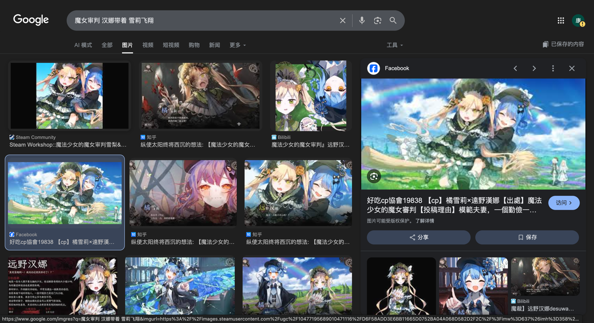
https://www.google.com/
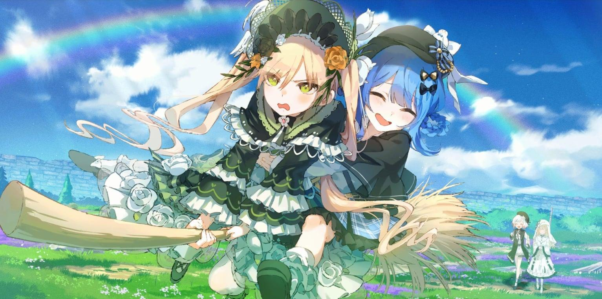
### 2. 线上 ps 预处理图片
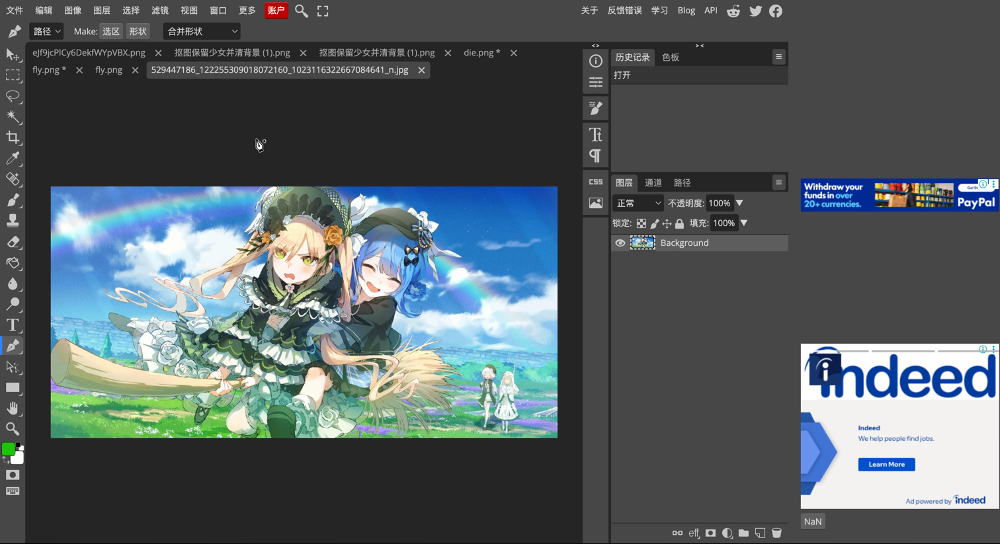
https://www.photopea.com/?ifxdh.com
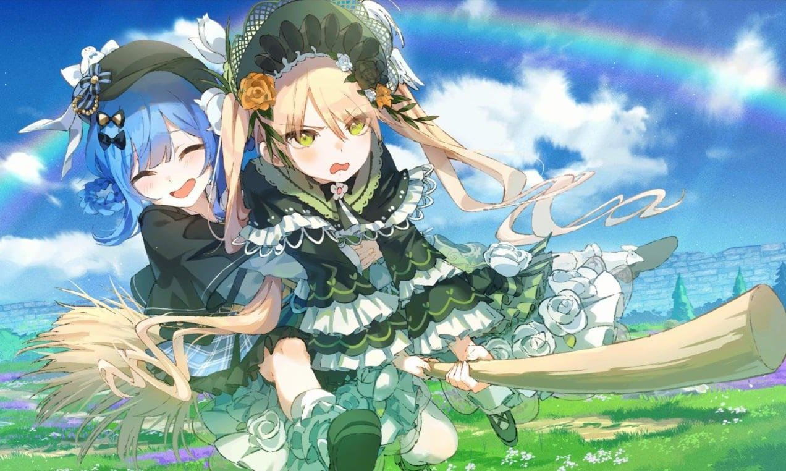
### 3. 豆包抠图
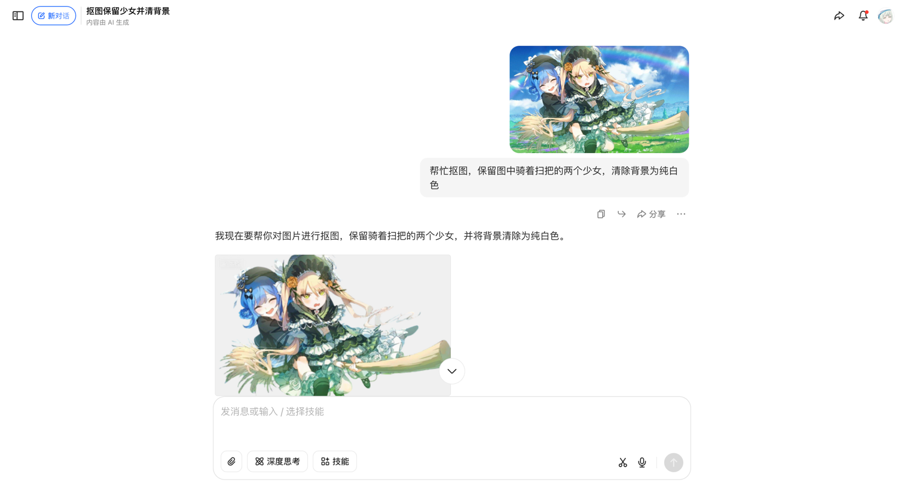
https://www.doubao.com/chat/22086571018430978

### 4. holopix 生成风格化图片
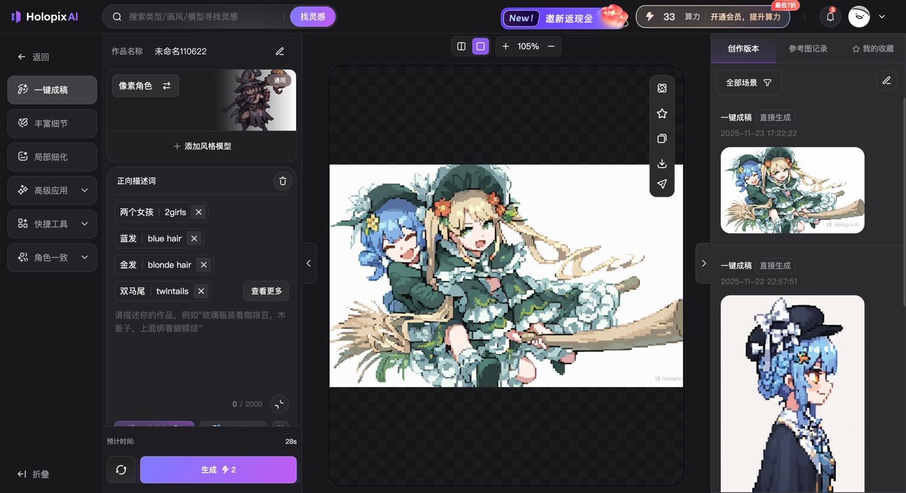
https://holopix.cn/workspace/explore
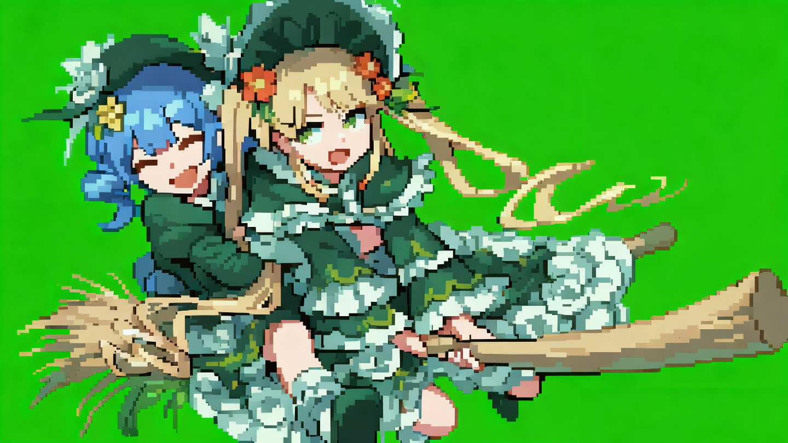
### 5. 即梦生成动画
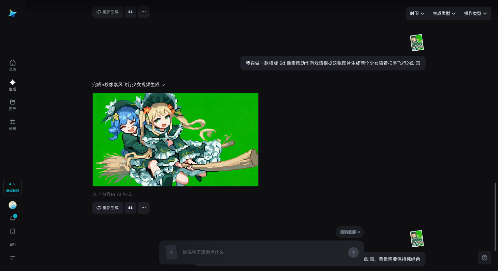
https://jimeng.jianying.com/ai-tool/generate

https://github.com/user-attachments/assets/6330817f-4b94-4a79-98ef-c9d8b10efed6

### 6. 动画拆分为帧动画
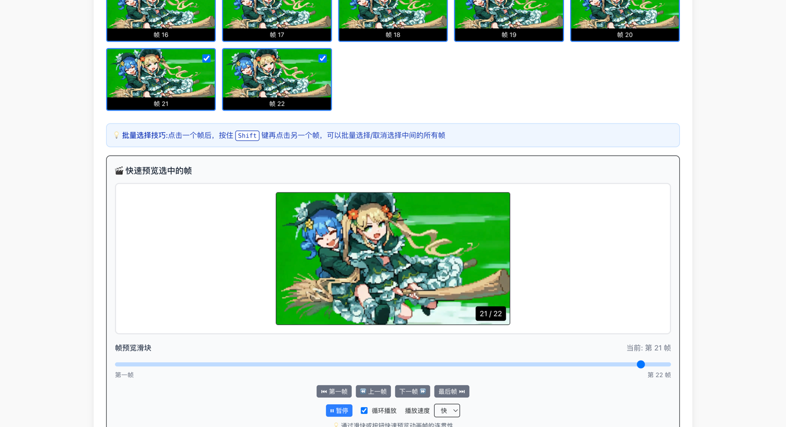
https://video2timesheet.dawnwindstudio.top/
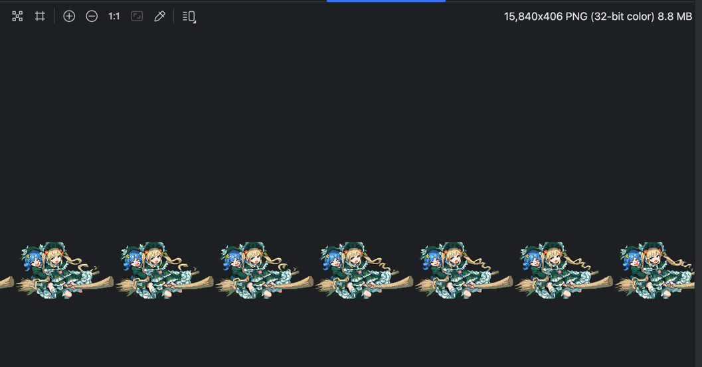
## 音频素材
原来也想用 AI 的不过测试下来几个效果都不好，不过查询过程也算是用 AI 了😂
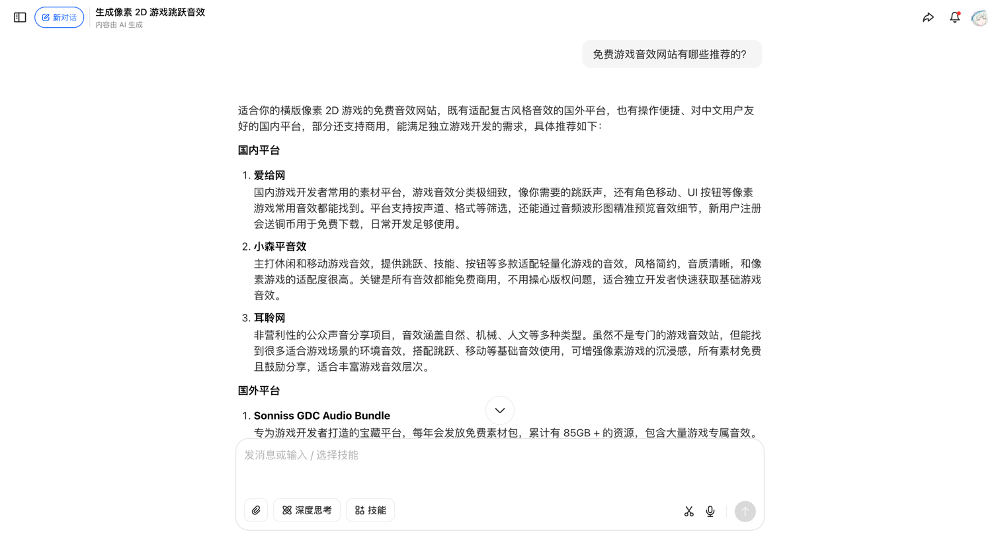
https://www.doubao.com/chat/30558944794456322

[bgm.mp3](https://github.com/user-attachments/files/23695954/bgm.mp3)

## 程序编写
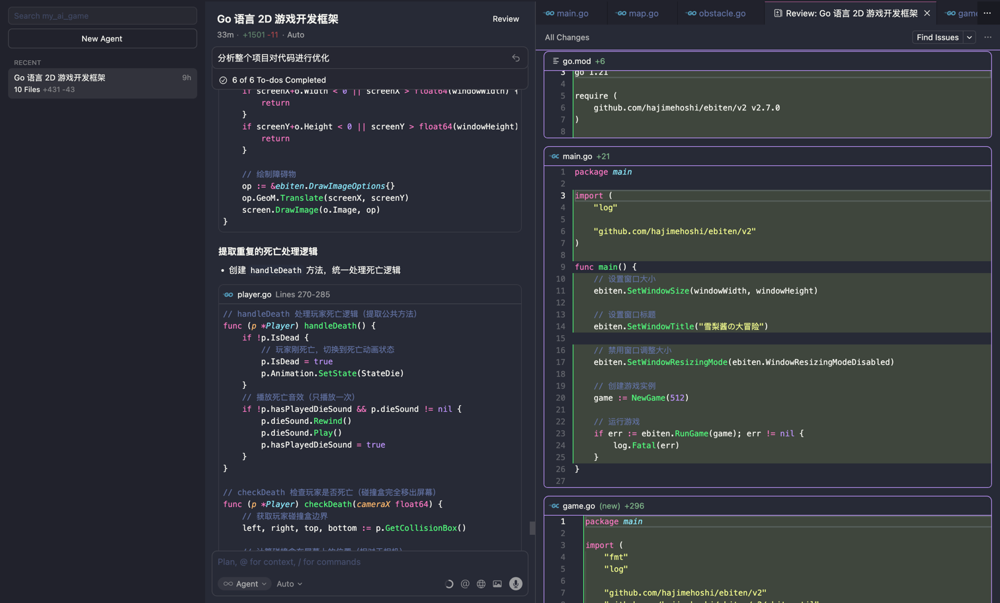
全程使用 cursor 完成
